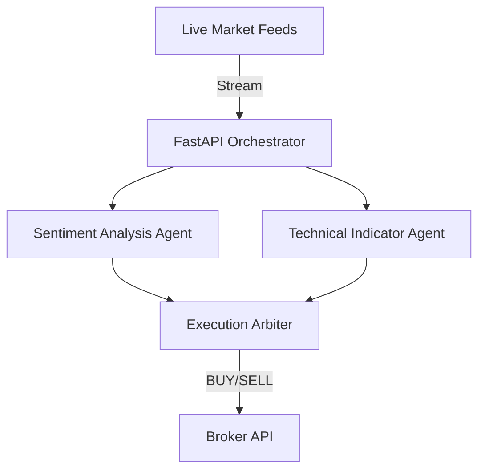

<div align="center">
  <h1>📈 AI Wall Street</h1>
  <p><b>Autonomous AI Trading Swarm & Market Sentiment Analyzer</b></p>

  
  
  
  
  
</div>

<br>

---

## ⚡ Executive Summary

Wall Street quantitative firms spend millions building low-latency algorithmic trading infrastructure. **AI Wall Street** levels the playing field by providing an open-source, autonomous swarm of AI agents built specifically for local edge inference to analyze market sentiment and execute trading strategies.

## 🏗️ Architecture Overview

By moving inference entirely to the edge, this architecture eliminates cloud API latency and keeps your proprietary trading algorithms 100% private.



## ✨ Core Capabilities

*   **Zero Latency Inference:** Eradicate API network overhead. In algorithmic trading, execution speed is everything.
*   **Absolute Algorithm Privacy:** Your proprietary trading algorithms and alpha models never leak to third-party language models like OpenAI or Anthropic.
*   **Production-Ready:** Engineered with Python 3.10+, complete with CI/CD pipelines and a comprehensive test suite.

---

## 🚀 Quick Start Guide

### 1. Installation

Clone the repository and install dependencies instantly using the built-in Makefile:
```bash
git clone https://github.com/lakshanmuruganandam/ai-wall-street.git
cd ai-wall-street
make install
```

### 2. Boot the Swarm

Launch the trading engine:
```bash
make run
```
The API will be available at `http://127.0.0.1:8000/docs`.

### 3. Run the Test Suite

```bash
make test
```

## 📝 License

Distributed under the MIT License. See `LICENSE` for more information.
