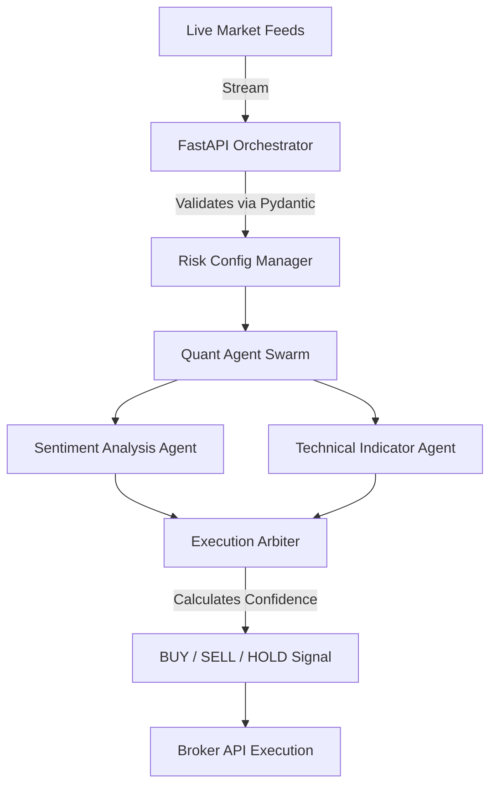

<div align="center">
  <h1>📈 AI Wall Street</h1>
  <p><b>Autonomous AI Trading Swarm & Market Sentiment Analyzer</b></p>

  
  
  
  
  
</div>

<br>

---

## ⚡ Executive Summary

Wall Street quantitative firms spend tens of millions of dollars building low-latency algorithmic trading infrastructure. **AI Wall Street** levels the playing field for retail investors by providing an open-source, autonomous swarm of AI agents built specifically for local edge inference. 

By executing complex sentiment analysis and technical indicator mapping locally, the system completely eradicates network latency and prevents your proprietary trading algorithms from leaking to third-party LLM APIs.

## 🏗️ Swarm Architecture

The core relies on a high-concurrency **FastAPI** orchestrator, which delegates incoming market data streams to specialized "Quant" agents.



## ✨ Core Capabilities

*   **Zero Latency Inference:** Eradicate API network overhead. In algorithmic trading, execution speed is everything.
*   **Absolute Algorithm Privacy:** Your proprietary trading algorithms and alpha models never leak to external servers.
*   **Dynamic Risk Tolerance:** Tunable via `.env` configurations, allowing the swarm to shift from conservative to highly aggressive logic models instantly.
*   **Production-Ready Modularity:** Engineered with strict Domain-Driven Design (DDD), decoupling HTTP routing from core Quant Agent logic and Pydantic validation schemas.

---

## 📂 Project Structure

```text
ai-wall-street/
├── src/
│   ├── api/
│   │   └── router.py       # FastAPI HTTP endpoints
│   ├── core/
│   │   └── config.py       # Risk tolerance & Env Loaders
│   ├── models/
│   │   └── quant.py        # Pydantic schemas (TradeSignal, ExecutionOutput)
│   ├── services/
│   │   └── agent.py        # Core autonomous Quant Swarm logic
│   └── main.py             # ASGI Application Entrypoint
├── tests/
│   └── test_main.py        # Pytest suites for trade logic
├── .github/workflows/
│   └── ci.yml              # Automated CI/CD pipelines
├── Makefile                # Quickstart commands
└── requirements.txt        # Strict dependency locking
```

---

## 🚀 Quick Start Guide

### Prerequisites
*   Python 3.10 or higher
*   (Optional) An active `.env` file to configure risk tolerance.

### 1. Installation

Clone the repository and install dependencies instantly using the built-in Makefile:
```bash
git clone https://github.com/lakshanmuruganandam/ai-wall-street.git
cd ai-wall-street
make install
```

### 2. Configuration (Optional)

Create a `.env` file in the root directory to tune the swarm's aggressiveness:
```ini
ENVIRONMENT=production
RISK_TOLERANCE=0.75
```

### 3. Boot the Swarm

Launch the trading engine:
```bash
make run
```
The API will be available at `http://127.0.0.1:8000/docs`.

### 4. Run the Test Suite

```bash
make test
```

---

## 🗺️ Future Roadmap

- [ ] **Phase 2:** Direct integration modules for Alpaca, Interactive Brokers, and Binance APIs.
- [ ] **Phase 3:** WebSockets support for sub-millisecond data streaming into the swarm.
- [ ] **Phase 4:** Reinforcement Learning module allowing the Arbiter to update its weights based on the PnL of historical trades.

## 🤝 Contributing

We welcome contributions from quantitative researchers and engineers! Please follow our strict CI guidelines:
1. Fork the repository.
2. Create your feature branch (`git checkout -b feature/NewIndicator`).
3. Ensure all tests pass (`make test`).
4. Open a Pull Request.

## 📝 License

Distributed under the MIT License. See `LICENSE` for more information.
