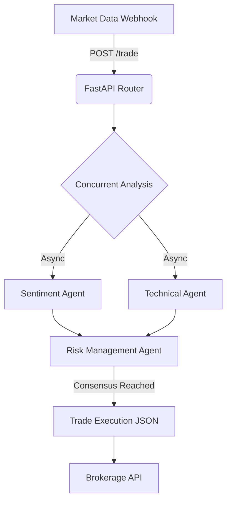

<div align="center">
  <h1>📈 AI Wall Street</h1>
  <p><b>An autonomous, local swarm of quantitative AI agents that analyze markets and trade with zero latency.</b></p>
  
  
  
</div>

## 📖 The Story
Stop trusting random Reddit threads for stock advice. I wanted a personal hedge fund that runs locally on my MacBook. So I built an autonomous swarm of quant agents. 

Instead of relying on a single slow API call, the architecture spins up independent, highly-specialized agent microservices that analyze real-time data concurrently and battle over execution rights.

## 🚀 How it Works
1. **The Sentiment Analyst:** Analyzes news, earnings transcripts, and social media sentiment (e.g., `-1.0` to `1.0`).
2. **The Technical Analyst:** Parses charts, Moving Averages (50-day vs 200-day), and MACD crossover logic.
3. **The Risk Manager:** Merges the asynchronous outputs, debates the confidence interval, and outputs a final `BUY/SELL/HOLD` command.

### 🧠 Swarm Architecture


## 🛠️ Quickstart

```bash
# 1. Clone the repository
git clone https://github.com/lakshanmuruganandam/ai-wall-street.git
cd ai-wall-street

# 2. Setup the virtual environment
python3 -m venv .venv
source .venv/bin/activate

# 3. Install dependencies
pip install -r requirements.txt

# 4. Start the Quant Fund
uvicorn src.main:app --reload
```

Hit `http://127.0.0.1:8000/docs` to start feeding market data to the swarm.

## 📦 Tech Stack
- **FastAPI:** Sub-millisecond trade orchestration.
- **Pydantic V2:** Strict risk-management validation so you don't liquidate your portfolio.
- **Pytest-Asyncio:** Ensuring concurrent execution pathways are absolutely bulletproof.

## 🤝 Contributing
Want to add a new quant model or connect a live brokerage? Open a PR.

---
*Built with ❤️ by Lakshan Muruganandam*
